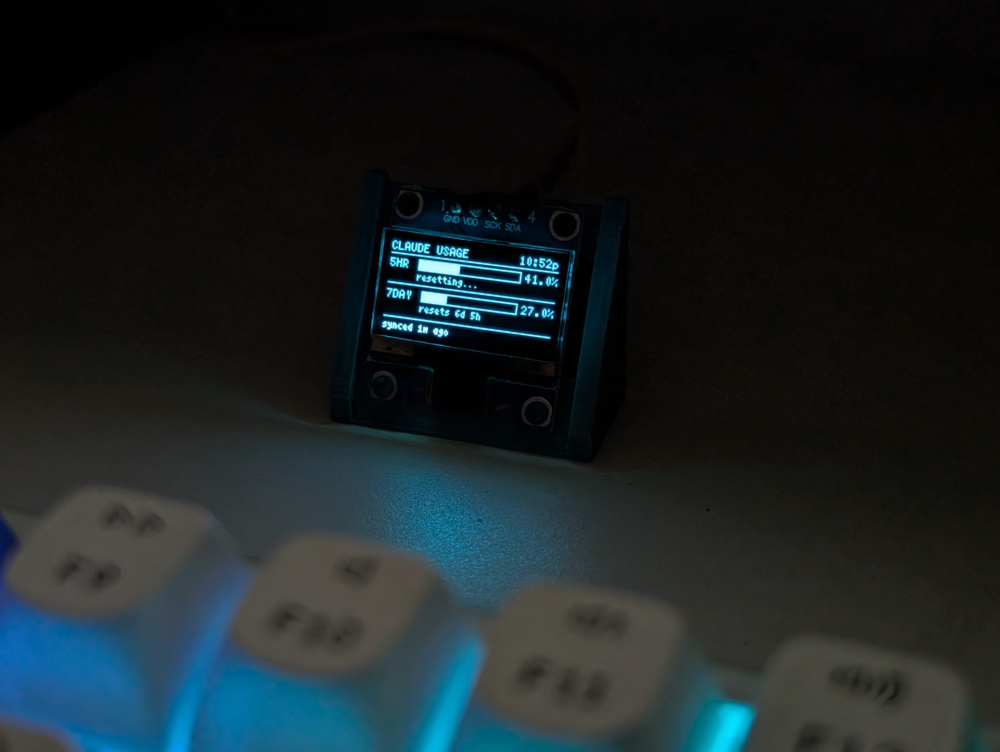
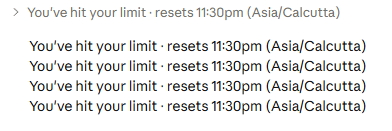
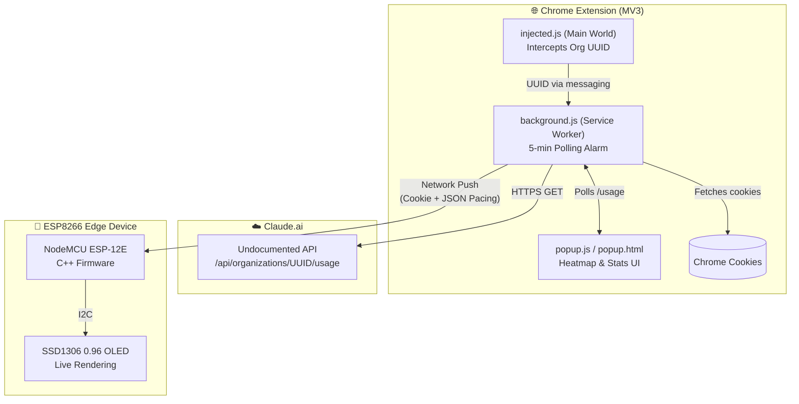
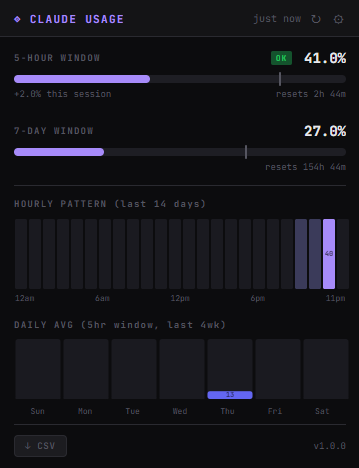
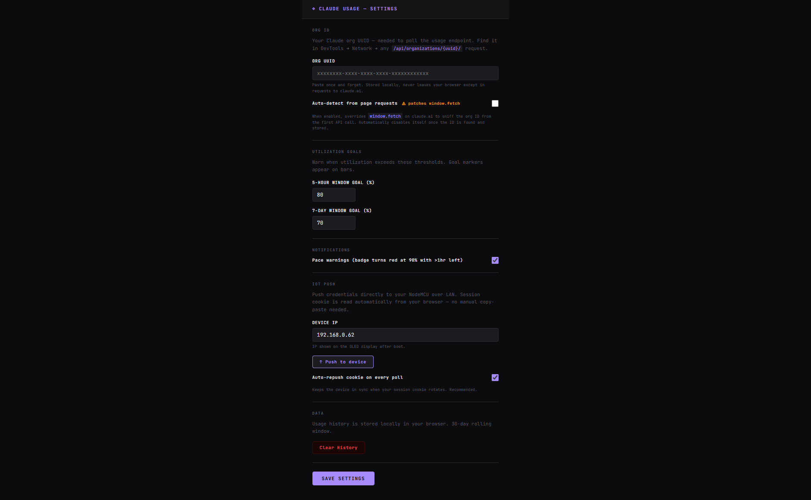

<div align="center">

# ◈ Claude Usage Monitor — Hyper-Local Token Telemetry

### *The Unnecessarily Intrusive API Interceptor & Desk Widget*

A Chrome extension and ESP8266 IoT hardware widget that relentlessly tracks your Claude.ai message limits in real time. Because checking a settings page like a normal person wasn't an option.

<br>



<br>

<em>Exactly what you need to see, without turning the monitor on.</em>

<br><br>

---

**Part of the *Over Engineered by Venky* Series**

> *Welcome to "Over Engineered by Venky", a growing collection of projects where the solution is gloriously, unapologetically disproportionate to the problem. Need to know how many Claude messages you have left? Sure, you could just wait for the "x messages remaining until y time" banner to appear, or try to guess your rolling 5-hour window. But why guess? Instead, you can write a Manifest V3 Chrome Extension that injects scripts into the main world to intercept undocumented API traffic. Have it parse your organization UUID, silently poll Claude's backend every 5 minutes, and auto-rotate session cookies. Then, push that telemetry over your local network to an ESP-12E NodeMCU driving a 0.96" OLED display sitting on your desk. Every project in this series exists because "but I could over-engineer that with data" is a lifestyle, not a suggestion. Efficiency? Optional. Style points? Mandatory.*

---

[](#)
[](#)
[](#)
[](#)
[](#)
[](#)

</div>

---

## 📖 Background

It started with Claude's invisible usage limits. Whether you're on a Free account hitting your daily ceiling or a Pro user micromanaging a 5-hour rolling message window and a 7-day cap, the problem is identical: there is no persistent usage meter. Just a vague sense of dread and an abrupt banner telling you that you've been cut off until 4 PM. 

<br>

<div align="center">

<br>
<em>The Inciting Incident: The dreaded native chat UI banner that made a hardware desk widget necessary.</em>
</div>

<br>

**The Plan:** Unlike most normal Chrome extensions, this one had to be aggressive. It needed to continuously poll Claude's undocumented internal `/usage` API. But even having a beautifully color-coded heatmap badge on your browser wasn't enough. What if the browser was closed? The solution was to beam the telemetry straight to a specialized hardware widget running custom C++ firmware that ticks down the seconds until you're allowed to generate tokens again. 

**The Dataset:** Two utilization windows. Two progress bars. One hour-by-hour operational heatmap. Zero official API support.

The Chrome extension is fully standalone — badge, heatmap, and all stats work without any hardware. The OLED widget is an optional physical layer for when the browser is closed or you just want ambient desk presence. Once configured, the hardware widget polls Claude's API independently — the browser doesn't need to stay open. The extension handles initial setup and silently refreshes the session cookie when it is open, but the OLED keeps counting down regardless.

---

## 🆚 The Problem vs. The Over-Engineered Solution

| | The Normal Solution | The Venky Solution |
|---|---|---|
| **Monitoring** | Wait for the warning banner to pop up. | Inject a Main-World script to intercept HTTP requests and extract your Organization UUID. |
| **Tracking** | Try to remember when you sent your last message. | Continuously poll an undocumented `/usage` endpoint every 5 minutes like a surveillance state. |
| **Pacing** | Just type less. | Receive system notifications and view an hourly heatmap spanning the last 14 days of your prompt behavior. |
| **Off-Screen** | Open a new tab to check Claude. | Drive a 0.96" OLED on an ESP8266 NodeMCU beside your keyboard tracking real-time cooldowns. |
| **Auth Setup** | Refresh the page and log in. | Have the extension silently capture and push new session cookies directly to the microcontroller behind your back. |

Because why trust your gut when you can maintain a real-time, hardware-accelerated dashboard of your API addiction?

---

## 🔧 The Hardware: Edge Display on a Budget

The hardware edge ensures your AI burnout is always visible. The Chrome extension is merely the brains; the NodeMCU is the dedicated broadcast tower.

### 🛒 Bill of Materials

| # | Component | Role | Cost (₹) |
|---|-----------|------|-----------|
| 1 | **NodeMCU ESP-12E** | WiFi-enabled ESP8266 board. Runs the HTTP client and self-configures via a Web Portal. | ~350 |
| 2 | **0.96" SSD1306** | I2C OLED display. Renders the usage bars and reset timers in glorious monochrome. | ~200 |
| | | **Total** | **~₹550** |

> **~₹550**: roughly the cost of a large cold brew. A small price to pay to guarantee you never blindly hit a rate limit again.

### 🧠 The Hack

The system relies on a two-part symbiotic relationship between the browser and the microcontroller:

1. **The Interception**: The MV3 extension injects `injected.js` into the Main World of the page, bypassing Chrome's isolated-world limitations, to silently sniff the undocumented `/organizations/{uuid}/` endpoint and extract your UUID.
2. **The Relay**: The Chrome extension handles the auth by automatically beaming rotating `sessionKey` cookies directly to the NodeMCU every 5 minutes on your Local Area Network.
3. **The Display**: The NodeMCU takes the raw JSON payload and reconstructs the data into ASCII progress bars (`[████░░░░░░░]`) running at 128x64 resolution.
4. **The Timekeeper**: The NodeMCU utilizes NTP to keep exact IST time, autonomously ticking the cooldown timers between the extension's explicit 5-minute polling intervals. 

If the browser crashes, the desk widget keeps counting down.

---

## 🏗️ Edge-to-Dashboard Architecture



---

## 📊 The Technical Debt Tour

> **Full disclosure:** To make this work, several deliberate crimes against software engineering were committed.

| The Crime | Why it was necessary |
|-----------|----------------------|
| **Main-world `<script>` tags** | MV3 content scripts are heavily isolated. A standard `window.fetch` patch does nothing from the context block, so we inject raw DOM scripts to wiretap network traffic natively. |
| **`setInsecure()` on ESP8266 TLS** | ESP8266 BearSSL requires certificate fingerprints. Claude's load balancers constantly rotate their certs. No TLS validation, just vibes. |
| **Polling instead of WebSockets** | Anthropic doesn't exactly expose a GraphQL subscription for this. We hammer an endpoint every 5 minutes instead. |
| **The 24-second Chrome alarm** | MV3 Service Workers aggressively go to sleep, wiping the live badge data. An invisible alarm fires constantly just to keep the extension context actively "breathing". |

---

## 📸 Dashboard Showcase

*(An over-engineered project requires an overly dense presentation format.)*

<div align="center">

<table>
  <tr>
    <td align="center"></td>
    <td align="center"></td>
  </tr>
  <tr>
    <td align="center"><em>The Extension: 14-day heatmap, daily averages, and rolling limits</em></td>
    <td align="center"><em>The Core Config: Target IPs, Goal Thresholds, and Push Triggers</em></td>
  </tr>
</table>

</div>

---

## 🚀 Quick Start

### 1. The Extension (Standalone)

1. Clone or download this repository.
2. Go to `chrome://extensions` → **Developer Mode** → **Load Unpacked**.
3. Point it to the `claude-usage-ext` directory.
4. Open `claude.ai` — your Org ID is auto-detected on the first API call.
5. Watch the badge instantly materialize with your 5-hour utilization.

Optional. Skip this entirely if you just want the browser extension.

### 2. The IoT Widget (Optional Hardware Addon)

1. Wire your OLED to the NodeMCU (`VCC`→`3V3`, `GND`→`GND`, `SDA`→`D2`, `SCL`→`D1`).
2. Install the `U8g2`, `WiFiManager`, and `ArduinoJson` libraries in your Arduino IDE.
3. Flash `claude_monitor/claude_monitor.ino` at 115200 baud.
4. The device spins up a **ClaudeMonitor** access point. Connect to it, go to `192.168.4.1`, and enter your WiFi details.
5. Open the Chrome Extension Settings, enter the NodeMCU's local LAN IP address, and click **↑ Push to device**.

Cookie rotation and status updates are entirely automated from then on. 

---

## 📁 Project Structure

```
claude-usage-ext/
├── background.js              # The Core: Alarms, Fetching, and IoT Relay Push
├── content.js                 # The Bridge: Injects the sniffer into the page DOM
├── injected.js                # The Sniffer: Main-world fetch interception hook
├── manifest.json              # Extension MV3 configuration & permissions
├── popup.html / .css / .js    # The Heatmap Dashboard UI layer
├── options.html / .css / .js  # Settings & Edge Device Portal
├── claude_monitor/            # Hardware Logic
│   └── claude_monitor.ino     # C++ Firmware for the ESP8266 + SSD1306
├── docs/images/               # UI and hardware photography
├── icons/                     # Extension branding assets
├── README_firmware.md         # Boring technical pins and library instructions
└── README.md                  # You are here
```

---

## 📄 License & Fair Use

This project interacts with an undocumented, continuously changing private API. If Anthropic changes the endpoint structure, adds strict CORS locking, or modifies authentication tokens, this will break instantly. It is built strictly as a personal engineering stress-test to monitor one's own data, and sends absolute zero telemetry to the cloud.

> *Use responsibly. Stop refreshing the metrics page and get back to work.*

---

<div align="center">

**Over Engineered with ⚙️ by Venky**
</div>
