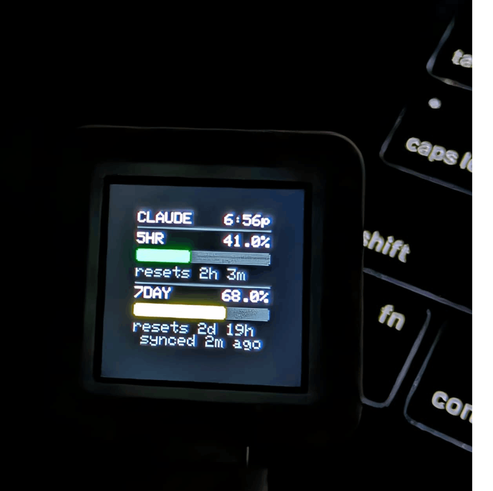
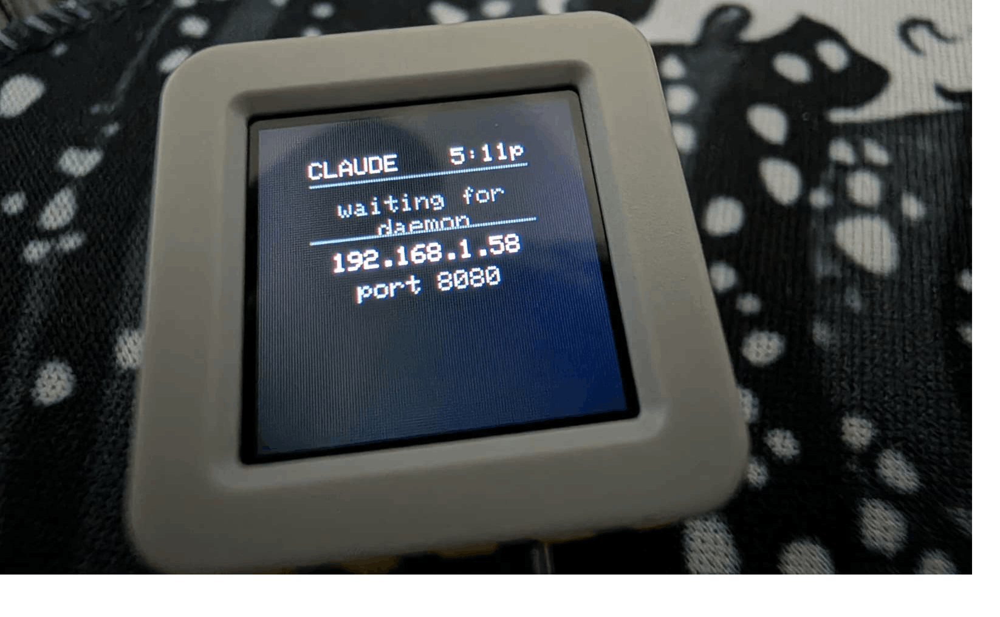

# Claude Usage Monitor

Real-time Claude.ai usage tracking on a dedicated hardware desk widget. A Rust daemon reads your Claude CLI OAuth credentials, polls the Anthropic usage API, and pushes utilization data over LAN to an ESP8266 or M5Stack ATOMS3R display. A standalone Chrome extension provides in-browser monitoring without any hardware.

<div align="center">

</div>

---

## Table of Contents

- [Quick Start](#quick-start)
- [Requirements](#requirements)
- [Daemon (Rust)](#daemon-rust)
- [Hardware: M5Stack ATOMS3R](#hardware-m5stack-atoms3r)
- [Hardware: ESP8266 + OLED](#hardware-esp8266--oled)
- [WiFi Setup (Both Devices)](#wifi-setup-both-devices)
- [Chrome Extension](#chrome-extension)
- [Architecture](#architecture)
- [Project Structure](#project-structure)
- [License](#license)

---

## Quick Start

The interactive setup script handles daemon installation, startup services, firmware dependencies, building, and flashing.

```bash
./setup.sh
```

It shows a status dashboard with detection indicators for installed tools and components, then presents a menu:

```
1) Install daemon binary       5) Uninstall startup service
2) Uninstall daemon binary     6) Install firmware dependencies
3) Install startup service     7) Build firmware
4) Change device host IP       8) Flash firmware
                               9) Quit
```

Non-interactive usage:

```bash
./setup.sh --install-daemon                            # download prebuilt binary
./setup.sh --install-service --device-host 192.168.1.50  # set up auto-start
./setup.sh --status                                    # show dashboard only
```

The general flow:

1. Install the daemon (prebuilt binary or build from source).
2. Flash firmware to your hardware device.
3. Configure WiFi on the device via captive portal.
4. Point the daemon at the device IP shown on the display.

---

## Requirements

### Software

| Tool | Used for | Install |
|------|----------|---------|
| [Rust](https://rustup.rs/) 1.70+ | Building the daemon from source (not needed for prebuilt binaries) | `curl --proto '=https' --tlsv1.2 -sSf https://sh.rustup.rs \| sh` |
| [PlatformIO](https://platformio.org/) | Building and flashing ATOMS3R firmware | macOS: `brew install platformio`, Linux: `pip3 install platformio` |
| [arduino-cli](https://arduino.github.io/arduino-cli/) | Building and flashing ESP8266 firmware | macOS: `brew install arduino-cli`, Linux: [install script](https://arduino.github.io/arduino-cli/installation/) |
| Claude CLI | OAuth token source (run `claude` and log in) | See [Claude Code docs](https://docs.anthropic.com/en/docs/claude-code) |

### Platform Support

| Platform | Daemon | Firmware flashing |
|----------|--------|-------------------|
| macOS (x86_64, arm64) | Yes | Yes |
| Linux (x86_64, aarch64) | Yes | Yes |
| Windows | Not supported | Not supported |

### Hardware

Pick one display device:

| Device | Cost | Wiring | Display |
|--------|------|--------|---------|
| [**M5Stack ATOMS3R**](https://www.amazon.com/dp/B0F1X6JSBL) (recommended) | ~$20 | None (self-contained, USB-C) | 0.85" round color IPS, 128x128 |
| **NodeMCU ESP-12E** + SSD1306 OLED | ~$5.50 | 4 wires (I2C) | 0.96" monochrome, 128x64 |

---

## Daemon (Rust)

The daemon reads OAuth tokens written by the Claude CLI, polls `api.anthropic.com/api/oauth/usage` every 5 minutes, and pushes the results to your hardware device over LAN HTTP.

### Install

**Prebuilt binary** (no Rust needed):

```bash
./setup.sh --install-daemon
```

This downloads the correct binary for your OS and architecture to `~/.local/bin/`.

**Build from source:**

```bash
cd claude_usage_daemon
cargo build --release
```

Binary: `claude_usage_daemon/target/release/claude-usage-daemon`

See [claude_usage_daemon/README.md](claude_usage_daemon/README.md) for full daemon documentation.

### Run

```bash
claude-usage-daemon --device-host 192.168.1.50
```

All options:

```
-H, --device-host <HOST>   Required. Device IP or hostname.
-p, --device-port <PORT>   Device port. Default: 8080.
-k, --api-key <KEY>        Shared secret (must match firmware). Default: sup3rs3cr3t.
-n, --interval <SECS>      Poll interval in seconds (min 10). Default: 300.
-c, --config-dir <DIR>     Claude config directory. Default: ~/.claude.
-d, --daemon               Fork to background (Unix only).
-f, --pid-file <PATH>      PID file path. Default: $TMPDIR/claude-usage-daemon.pid.
```

### Auto-Start

Use the setup script to configure a startup service:

```bash
./setup.sh --install-service --device-host 192.168.1.50
```

This installs a launchd plist (macOS) or systemd user service (Linux) that starts the daemon on login. Manage it later with:

```bash
./setup.sh --change-host 192.168.1.100   # update device IP
./setup.sh --uninstall-service            # remove auto-start
```

### Credentials

The daemon reads OAuth tokens from the Claude CLI. Run `claude` and complete the login prompt before first use.

| Platform | Primary source | Fallback |
|----------|---------------|----------|
| macOS | Keychain (`Claude Code-credentials`) | `~/.claude/.credentials.json` |
| Linux | -- | `~/.claude/.credentials.json` |

Tokens are refreshed automatically when they expire. The daemon never stores or transmits your OAuth credentials to the hardware device. It only pushes pre-parsed usage percentages.

For details on how usage data is retrieved and why API keys cannot be used, see [How Usage Data Works](docs/HOW_USAGE_DATA_WORKS.md).

---

## Hardware: M5Stack ATOMS3R

Self-contained build. No wiring, no breadboard. Plug in USB-C and go.

<div align="center">
<table>
  <tr>
    <td align="center"></td>
    <td align="center"></td>
  </tr>
  <tr>
    <td align="center"><em>Receiving usage data: color-coded bars and countdown timers</em></td>
    <td align="center"><em>After WiFi connect: waiting for first daemon push</em></td>
  </tr>
</table>
</div>

**Hardware:** [M5Stack ATOMS3R](https://www.amazon.com/dp/B0F1X6JSBL) (C126). ESP32-S3 dual-core, 0.85" round color IPS LCD (128x128), 8MB flash, 8MB PSRAM, built-in button, USB-C.

**Firmware location:** `claude_monitor_atoms3r/`

### Flash

Requires PlatformIO. Connect the ATOMS3R via USB-C.

```bash
# Via setup script
./setup.sh    # choose option 8, then ATOMS3R

# Via make
make flash-atoms3r

# Manual
cd claude_monitor_atoms3r && pio run -e atoms3r -t upload
```

After flashing, the device reboots and creates a WiFi access point called **ClaudeMonitor-Setup**. Connect to it from your phone or laptop, select your WiFi network in the captive portal, and the device joins your network. See [WiFi Setup](#wifi-setup-both-devices) for the full walkthrough.

The firmware ships with a default API key (`sup3rs3cr3t`) that matches the daemon's default. You do not need to change it unless you want a unique key for a shared network, in which case you must set it in both the firmware and the daemon (`--api-key` flag). To customize, edit `claude_monitor_atoms3r/src/main.cpp` before flashing:

```c
#define API_KEY   "your-custom-key"                 // must match daemon --api-key
#define TIMEZONE  "CST6CDT,M3.2.0,M11.1.0"         // POSIX TZ string for your timezone
```

### WiFi Reset

Hold the built-in button for 2 seconds to wipe saved WiFi credentials and reboot into setup mode.

See [claude_monitor_atoms3r/README.md](claude_monitor_atoms3r/README.md) for hardware specs, display layout, and WiFi troubleshooting.

---

## Hardware: ESP8266 + OLED

The breadboard build. Four wires, two components.

**Hardware:**
- NodeMCU ESP-12E (ESP8266)
- SSD1306 0.96" OLED (I2C, 128x64, monochrome)

**Wiring:**

| OLED Pin | NodeMCU Pin |
|----------|-------------|
| VCC | 3V3 |
| GND | GND |
| SDA | D2 (GPIO4) |
| SCL | D1 (GPIO5) |

**Firmware location:** `claude_monitor/`

### Flash

Requires arduino-cli with the ESP8266 board core and libraries installed.

```bash
# Install dependencies (one-time)
./setup.sh    # choose option 6, then ESP8266

# Flash
./setup.sh    # choose option 8, then ESP8266

# Or via make
make setup-esp8266   # one-time
make flash-esp8266
```

The Makefile auto-detects the serial port. Override if needed: `make flash-esp8266 SERIAL_PORT=/dev/ttyUSB0`

After flashing, the device reboots and creates a WiFi access point called **ClaudeMonitor-Setup**. Connect to it from your phone or laptop, select your WiFi network in the captive portal, and the device joins your network. See [WiFi Setup](#wifi-setup-both-devices) for the full walkthrough.

The firmware ships with a default API key (`sup3rs3cr3t`) that matches the daemon's default. You do not need to change it unless you want a unique key for a shared network, in which case you must set it in both the firmware and the daemon (`--api-key` flag). To customize, edit `claude_monitor/claude_monitor.ino` before flashing:

```c
#define API_KEY   "your-custom-key"       // must match daemon --api-key
#define TIMEZONE  "IST-5:30"              // POSIX TZ string for your timezone
```

### WiFi Reset

Hold the FLASH button (GPIO0) for 2 seconds to wipe saved WiFi credentials and reboot into setup mode.

See [README_firmware.md](README_firmware.md) for pin reference and display layout.

---

## WiFi Setup (Both Devices)

Neither device stores WiFi credentials in firmware. After flashing, WiFi is configured via a captive portal:

1. On first boot, the device creates a temporary AP called **ClaudeMonitor-Setup** (open, no password).
2. Join that network from your phone or laptop.
3. A captive portal opens automatically (or browse to `192.168.4.1`).
4. Select your **2.4 GHz** WiFi network and enter the password.
5. The device saves credentials to flash, reboots, and connects via DHCP.
6. The display shows the assigned IP address and listening port (default 8080).

Credentials persist across reboots. To reconfigure, hold the reset button for 2 seconds (FLASH button on ESP8266, built-in button on ATOMS3R).

Once connected, start the daemon pointed at the displayed IP:

```bash
claude-usage-daemon --device-host <IP_FROM_DISPLAY>
```

If no data is received for 10 minutes, the device shows a STALE indicator.

---

## Chrome Extension

The Chrome extension monitors Claude usage independently. No daemon or hardware required. It can also push data to a hardware device if configured.

<div align="center">

</div>

### Install

1. Clone or download this repository.
2. Open `chrome://extensions` in Chrome.
3. Enable **Developer Mode** (top right toggle).
4. Click **Load unpacked** and select the repository root (where `manifest.json` is).
5. Open [claude.ai](https://claude.ai). The extension auto-detects your organization ID on the first API call.

### Features

- **Badge:** Shows 5-hour utilization percentage. Color-coded green/amber/red.
- **Popup:** 14-day hourly heatmap, daily averages, reset countdown timers.
- **Notifications:** Alert when utilization hits 90% with more than 1 hour remaining in the window.
- **CSV export:** Download usage history from the popup.
- **IoT push:** Optionally push usage data to a hardware device on every poll (configure in Settings > IoT Device Push).

### Settings

<div align="center">

</div>

Configure the 5-hour usage goal (default 50%), pace notifications, and hardware device push (IP, API key, auto-push toggle).

### How It Works

The extension uses browser session cookies (you must be logged into claude.ai) to poll `claude.ai/api/organizations/{orgId}/usage` every 5 minutes. No OAuth tokens or API keys are needed. See [How Usage Data Works](docs/HOW_USAGE_DATA_WORKS.md) for details.

---

## Architecture

```
Claude CLI (OAuth login)
        |
        v
macOS Keychain / ~/.claude/.credentials.json
        |
        v
Rust Daemon (claude-usage-daemon)
  1. Read OAuth tokens
  2. GET api.anthropic.com/api/oauth/usage
  3. Refresh tokens if expired
  4. POST http://device:8080/usage (HMAC-SHA256 auth)
        |
        v
Hardware Device (ESP8266 or ATOMS3R)
  - Passive HTTP server on LAN
  - Displays usage bars and countdowns
  - Stores zero credentials
```

The Chrome extension operates independently through the browser, using session cookies instead of OAuth tokens. Both the daemon and the extension can push to the same hardware device using the same `POST /usage` protocol with [HMAC-SHA256 authentication](docs/SECURITY.md).

For a detailed breakdown of authentication, API endpoints, and data formats, see [How Usage Data Works](docs/HOW_USAGE_DATA_WORKS.md).

---

## Project Structure

```
.
├── claude_usage_daemon/           # Rust daemon
│   ├── Cargo.toml
│   ├── src/
│   │   ├── main.rs                # CLI args, poll loop, daemonization
│   │   ├── credentials.rs         # Keychain/file reading, token refresh
│   │   ├── usage.rs               # Usage API fetch, response models
│   │   └── push.rs                # HTTP push to device, HMAC auth
│   └── resources/
│       ├── com.claude.usage-daemon.plist   # macOS launchd template
│       └── claude-usage-daemon.service     # Linux systemd template
│
├── claude_monitor/                # ESP8266 firmware (Arduino)
│   └── claude_monitor.ino
│
├── claude_monitor_atoms3r/        # ATOMS3R firmware (PlatformIO)
│   ├── platformio.ini
│   └── src/main.cpp
│
├── shared/
│   └── claude_monitor_common.h    # Shared auth, HTTP handlers, display logic
│
├── background.js                  # Chrome extension service worker
├── content.js                     # Extension: page injection
├── injected.js                    # Extension: fetch interception for org ID
├── popup.html / popup.js          # Extension: dashboard UI
├── options.html / options.js      # Extension: settings
├── manifest.json                  # Extension manifest (MV3)
│
├── docs/
│   ├── HOW_USAGE_DATA_WORKS.md    # Auth and API deep dive
│   └── SECURITY.md                # HMAC auth protocol
│
├── setup.sh                       # Interactive setup script
├── Makefile                       # Build shortcuts
└── .github/workflows/             # CI and release builds
```

---

## License

This project interacts with OAuth APIs that may change. Built as a personal project to monitor one's own usage data. Sends zero telemetry.
