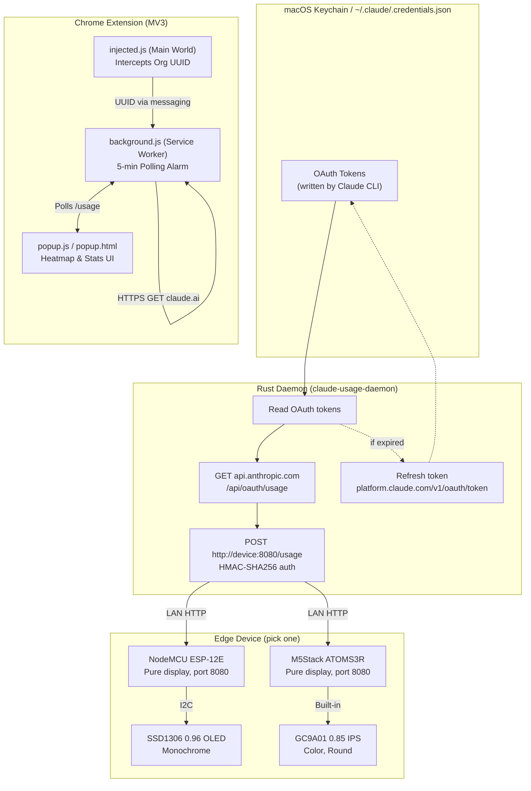

<div align="center">

# Claude Usage Monitor

### *Hyper-Local Token Telemetry for the Over-Engineered*

A three-part system that tracks your Claude.ai usage limits in real time and renders them on a dedicated hardware desk widget. A Rust daemon reads your Claude CLI OAuth credentials, polls the usage API, and pushes data over your LAN to an ESP8266 or M5Stack ATOMS3R display. A standalone Chrome extension provides in-browser heatmaps and stats without any hardware.

<br>


<br>

<em>Exactly what you need to see, without turning the monitor on.</em>

<br><br>

---

**Part of the *Over Engineered by Venky* Series**

> *Welcome to "Over Engineered by Venky", a growing collection of projects where the solution is gloriously, unapologetically disproportionate to the problem. Need to know how many Claude messages you have left? Sure, you could just wait for the "x messages remaining until y time" banner to appear, or try to guess your rolling 5-hour window. But why guess? Instead, you can build a Rust daemon that reads OAuth tokens from your macOS Keychain, polls Anthropic's API every 5 minutes, and pushes the telemetry over your local network to a microcontroller driving a dedicated display on your desk. Every project in this series exists because "but I could over-engineer that with data" is a lifestyle, not a suggestion. Efficiency? Optional. Style points? Mandatory.*

---

[](#)
[](#)
[](#)
[](#)
[](#)
[](#)
[](#)

</div>

---

## Background

It started with Claude's invisible usage limits. Whether you're on a Free account hitting your daily ceiling or a Pro user micromanaging a 5-hour rolling message window and a 7-day cap, the problem is identical: there is no persistent usage meter. Just a vague sense of dread and an abrupt banner telling you that you've been cut off until 4 PM.

<br>

<div align="center">

<br>
<em>The Inciting Incident: The dreaded native chat UI banner that made a hardware desk widget necessary.</em>
</div>

<br>

**The Plan:** Build a lightweight Rust daemon that reads OAuth credentials from the Claude CLI's keychain storage, polls Anthropic's usage API every 5 minutes, and pushes the results to a dedicated hardware display over your LAN. No browser required. No credentials on the device. The Chrome extension remains fully standalone for in-browser monitoring.

**The Dataset:** Two utilization windows. Per-model breakdowns. Color-coded progress bars. One hour-by-hour operational heatmap. API key-authenticated device push.

---

## The Problem vs. The Over-Engineered Solution

| | The Normal Solution | The Venky Solution |
|---|---|---|
| **Monitoring** | Wait for the warning banner to pop up. | Run a Rust daemon that reads OAuth tokens from your macOS Keychain and polls the API. |
| **Tracking** | Try to remember when you sent your last message. | Poll `api.anthropic.com/api/oauth/usage` every 5 minutes and push to hardware. |
| **Pacing** | Just type less. | Receive system notifications and view an hourly heatmap spanning the last 14 days. |
| **Off-Screen** | Open a new tab to check Claude. | Drive a 0.96" OLED or a color round LCD on your desk with real-time cooldowns. |
| **Auth** | Refresh the page and log in. | The daemon reads tokens from keychain, refreshes them automatically, and the device stores zero secrets. |

---

## Architecture

The system has three independent layers. Use any combination.



**Key design decisions:**

- **Device stores zero secrets.** No credentials, no HTTPS client, no outbound connections. Pure display.
- **Daemon handles all auth.** Reads Keychain (macOS) or credentials file (Linux/Windows). Refreshes tokens. Pushes pre-parsed data.
- **HMAC auth on LAN.** Device uses HMAC-SHA256 challenge-response so the raw API key never crosses the wire. See [Security](docs/SECURITY.md).
- **Chrome extension is independent.** Badge, heatmap, and stats work without daemon or hardware.

> For a deep dive on how usage data is retrieved (and why API keys don't work), see [How Usage Data Is Retrieved](docs/HOW_USAGE_DATA_WORKS.md).

---

## The Hardware: Edge Display on a Budget

### Variant A: ESP8266 + OLED (Original)

The breadboard build. Four wires, two components, zero elegance.

| # | Component | Role | Cost |
|---|-----------|------|------|
| 1 | **NodeMCU ESP-12E** | WiFi-enabled ESP8266 board. Receives data over HTTP, displays on OLED. | ~350 |
| 2 | **0.96" SSD1306** | I2C OLED display. Renders usage bars and reset timers in monochrome. | ~200 |
| | | **Total** | **~550** |

### Variant B: M5Stack ATOMS3R (New)

The self-contained build. No wiring, no breadboard, no excuses. Plug in USB-C and go.

| # | Component | Role | Cost |
|---|-----------|------|------|
| 1 | **M5Stack ATOMS3R (C126)** | ESP32-S3 with built-in 0.85" round color IPS LCD (128x128), 8MB flash, 8MB PSRAM, button, WiFi. Everything in a 24x24x13mm package. | ~$8 |

**What you get over the ESP8266 build:**
- Color-coded progress bars (green/yellow/red by utilization)
- No soldering or wiring, the display is built in
- 30x more RAM, dual-core processor
- Round display that looks like a purpose-built gauge
- USB-C (no more micro-USB fumbling)

---

## Dashboard Showcase

*(An over-engineered project requires an overly dense presentation format.)*

<div align="center">

<table>
  <tr>
    <td align="center"></td>
    <td align="center"></td>
  </tr>
  <tr>
    <td align="center"><em>The Extension: 14-day heatmap, daily averages, and rolling limits</em></td>
    <td align="center"><em>The Core Config: Target IPs, Goal Thresholds, and Push Triggers</em></td>
  </tr>
</table>

</div>

---

## Quick Start

### 1. The Daemon (Rust)

The daemon reads OAuth credentials from the Claude CLI and pushes usage data to the hardware widget. Requires [Rust](https://rustup.rs/) and a working `claude` CLI login.

```bash
# Build
cd claude_usage_daemon
cargo build --release

# Or use make from the project root
make daemon
```

**Prerequisites:** Log in to Claude CLI first so OAuth tokens exist:

```bash
claude  # follow the login prompt; this writes tokens to Keychain / ~/.claude/.credentials.json
```

**Run in foreground** (ctrl+c to stop, errors printed to stderr):

```bash
./target/release/claude-usage-daemon \
  --device-ip 192.168.1.50 \
  --api-key "your-shared-secret"
```

**Run as background daemon** (Unix only):

```bash
./target/release/claude-usage-daemon \
  --device-ip 192.168.1.50 \
  --api-key "your-shared-secret" \
  --daemon
```

**All options:**

```
--device-ip <IP>       Required. LAN IP of the hardware widget.
--device-port <PORT>   Port the device listens on. Default: 8080.
--api-key <KEY>        Required. Must match API_KEY in firmware.
--interval <SECS>      Poll interval in seconds. Default: 300 (5 min).
--config-dir <DIR>     Override Claude config directory. Default: ~/.claude.
--daemon               Run as background daemon (Unix only).
--pid-file <PATH>      PID file path. Default: /tmp/claude-usage-daemon.pid.
```

**launchd (macOS auto-start):**

```bash
# Edit the plist to set your device IP and API key
cp claude_usage_daemon/resources/com.claude.usage-daemon.plist ~/Library/LaunchAgents/
# Edit ~/Library/LaunchAgents/com.claude.usage-daemon.plist with your values
launchctl load ~/Library/LaunchAgents/com.claude.usage-daemon.plist
```

**Credential sources (priority order):**

| Platform | Primary | Fallback |
|----------|---------|----------|
| macOS | Keychain (service: `Claude Code-credentials-{hash}`) | `~/.claude/.credentials.json` |
| Linux | N/A | `~/.claude/.credentials.json` |
| Windows | N/A | `%USERPROFILE%\.claude\.credentials.json` |

### 2. The Chrome Extension (Standalone)

The extension works entirely independently. No daemon or hardware required.

1. Clone or download this repository.
2. Go to `chrome://extensions`, enable **Developer Mode**, click **Load Unpacked**.
3. Point it to the repository root (where `manifest.json` lives).
4. Open `claude.ai`. Your Org ID is auto-detected on the first API call.
5. The badge shows your 5-hour utilization percentage.

### Firmware Dependencies

Use `make setup` to install everything at once, or follow the manual steps below.

<details>
<summary><strong>ESP8266 (arduino-cli)</strong></summary>

**macOS:**

```bash
brew install arduino-cli
make setup-esp8266
```

**Linux (Debian/Ubuntu):**

```bash
curl -fsSL https://raw.githubusercontent.com/arduino/arduino-cli/master/install.sh | sh
sudo mv bin/arduino-cli /usr/local/bin/
make setup-esp8266
```

**Manual (without make):**

```bash
arduino-cli core update-index --additional-urls https://arduino.esp8266.com/stable/package_esp8266com_index.json
arduino-cli core install esp8266:esp8266 --additional-urls https://arduino.esp8266.com/stable/package_esp8266com_index.json
arduino-cli lib install U8g2 WiFiManager "ArduinoJson@6"
```

</details>

<details>
<summary><strong>ATOMS3R (PlatformIO)</strong></summary>

**macOS:**

```bash
brew install platformio
```

**Linux:**

```bash
pip install platformio
# or: curl -fsSL -o get-platformio.py https://raw.githubusercontent.com/platformio/platformio-core-installer/master/get-platformio.py && python3 get-platformio.py
```

PlatformIO handles board packages and libraries automatically via `platformio.ini`.

</details>

### Serial Port

The Makefile auto-detects the serial port per OS:

| OS    | Default                              |
|-------|--------------------------------------|
| macOS | `/dev/cu.usbserial*`                 |
| Linux | `/dev/ttyUSB*` or `/dev/ttyACM*`     |

If detection fails (or you have multiple devices), override it:

```bash
make flash-esp8266 SERIAL_PORT=/dev/ttyUSB0
```

### 3a. IoT Widget: ESP8266 (requires wiring)

1. Wire your OLED to the NodeMCU (`VCC` to `3V3`, `GND` to `GND`, `SDA` to `D2`, `SCL` to `D1`).
2. **Edit `claude_monitor/claude_monitor.ino`**: set `API_KEY` to your shared secret and adjust `TZ_OFFSET_SEC` for your timezone.
3. Flash:

```bash
make flash-esp8266
```

4. The device spins up a **ClaudeMonitor** access point. Connect to it, go to `192.168.4.1`, enter your WiFi details.
5. The display shows the device's IP and port. Start the daemon pointed at that address.

### 3b. IoT Widget: M5Stack ATOMS3R (no wiring)

1. **Edit `claude_monitor_atoms3r/src/main.cpp`**: set `API_KEY` to your shared secret and adjust `TZ_OFFSET_SEC`.
2. Flash:

```bash
make flash-atoms3r
```

3. The device spins up a **ClaudeMonitor** access point. Connect, enter WiFi details.
4. The display shows its IP and port. Start the daemon.

### Putting it together

```bash
# 1. Flash the device (pick one)
make flash-esp8266    # or make flash-atoms3r

# 2. Note the IP:port shown on the device display (e.g., 192.168.1.50:8080)

# 3. Build and run the daemon
make daemon
./target/release/claude-usage-daemon \
  --device-ip 192.168.1.50 \
  --api-key "your-shared-secret"
```

The daemon polls every 5 minutes and pushes usage data. The device shows countdown timers that tick between pushes. If the daemon stops, the device shows a "STALE" indicator after 10 minutes.

### How data reaches the device

There are two independent ways to push usage data to the hardware display. Use whichever fits your setup.

| Path | How it works | Best for |
|------|-------------|----------|
| **Rust Daemon** | Reads OAuth tokens from Keychain/file, polls `api.anthropic.com/api/oauth/usage`, pushes `POST /usage` with HMAC auth to device over LAN. Runs headless. | Always-on monitoring without a browser. |
| **Chrome Extension** | Polls `claude.ai/api/organizations/{orgId}/usage` using session cookies, pushes `POST /usage` with HMAC auth to device on every poll. Configure in extension Settings > IoT Device Push. | Browser-based monitoring with hardware display. |

Both paths use the same device protocol (`POST /usage` with HMAC-SHA256 challenge-response), so you can switch between them or even run both (the device just displays the last push it received). See [Security](docs/SECURITY.md) for auth details.

If you only want in-browser monitoring (badge, heatmap, notifications), the Chrome extension works without any hardware or daemon.

---

## Project Structure

```
.
├── claude_usage_daemon/           # Rust daemon
│   ├── Cargo.toml                 # Dependencies and build config
│   ├── src/
│   │   ├── main.rs                # CLI args, poll loop, daemon/foreground modes
│   │   ├── credentials.rs         # Keychain + file reading, token refresh
│   │   ├── usage.rs               # OAuth usage API fetch + response models
│   │   └── push.rs                # HTTP push to device with API key auth
│   └── resources/
│       └── com.claude.usage-daemon.plist  # macOS launchd service config
│
├── claude_monitor/                # ESP8266 firmware
│   └── claude_monitor.ino         # Push-only display, API key auth, port 8080
│
├── claude_monitor_atoms3r/        # ATOMS3R firmware
│   ├── platformio.ini             # PlatformIO build config
│   ├── src/main.cpp               # Push-only display, API key auth, port 8080
│   └── README.md                  # ATOMS3R-specific hardware docs
│
├── background.js                  # Chrome extension: alarms, fetching, relay
├── content.js                     # Chrome extension: injects sniffer into page
├── injected.js                    # Chrome extension: main-world fetch interception
├── manifest.json                  # Extension MV3 configuration & permissions
├── popup.html / .css / .js        # Heatmap Dashboard UI layer
├── options.html / .css / .js      # Settings & configuration portal
├── icons/                         # Extension branding assets
├── docs/images/                   # UI and hardware photography
├── Makefile                       # Build shortcuts
├── README_firmware.md             # Hardware pin reference
└── README.md                      # You are here
```

---

## Technical Debt Tour

> **Full disclosure:** To make this work, several deliberate crimes against software engineering were committed.

| The Crime | Why it was necessary |
|-----------|----------------------|
| **Main-world `<script>` tags** | MV3 content scripts are heavily isolated. A standard `window.fetch` patch does nothing from the context block, so we inject raw DOM scripts to wiretap network traffic natively. |
| **XOR'd OAuth client ID** | The daemon uses a public OAuth client ID for token refresh. It's XOR-obfuscated in the binary to avoid appearing in `strings` output. Not real security, just hygiene. |
| **Polling instead of WebSockets** | Anthropic doesn't expose a subscription for usage data. We poll every 5 minutes. |
| **The 24-second Chrome alarm** | MV3 Service Workers aggressively go to sleep, wiping the live badge data. An invisible alarm fires constantly just to keep the extension context "breathing". |
| **`libc::daemon()` on macOS** | macOS marks this deprecated in favor of launchd, but it works fine and is the standard Unix daemonization call. We provide a launchd plist too. |
| **RFC1918 host permissions** | The extension needs to push usage data to a LAN device over plain HTTP. Permissions are restricted to private address ranges (192.168.x, 10.x, 172.16-31.x, localhost). |

---

## API Reference

### Device HTTP API

Both firmware variants expose the same HTTP API on port 8080 (configurable via `HTTP_PORT`).

Authenticated endpoints use HMAC-SHA256 challenge-response auth (nonce from `/ping`, signature in request headers). Legacy `X-API-Key` header is still accepted for backward compatibility. See [Security](docs/SECURITY.md) for details.

| Method | Path | Description |
|--------|------|-------------|
| `POST` | `/usage` | Push usage data from daemon. Body: JSON (see below). |
| `GET` | `/status` | Return current usage state, staleness, IP, and port. |

**POST /usage body:**

```json
{
  "five_hour": 45.2,
  "five_hour_resets_at": "2026-03-22T18:00:00Z",
  "seven_day": 12.8,
  "seven_day_resets_at": "2026-03-25T00:00:00Z",
  "seven_day_opus": 8.1,
  "seven_day_sonnet": 15.0,
  "timestamp": 1742673600
}
```

---

## Daemon Resource Profile

The Rust daemon is designed to run indefinitely as a background process. Profiled on Apple Silicon (arm64) over a 5-minute run with 10-second poll intervals:

| Metric | Value |
|--------|-------|
| Binary size | 3.8 MB (stripped, LTO) |
| Physical memory (macOS) | 4.5 MB |
| RSS steady-state | ~12 MB |
| RSS peak | 13 MB |
| CPU (idle) | 0.0% |
| Threads (steady-state) | 2 |

**No memory leak.** RSS peaked at 13 MB during initial HTTP client setup, then settled to ~12 MB. The macOS physical footprint (4.5 MB) reflects actual memory pressure. RSS is dominated by the TLS stack (rustls) and reqwest's connection pool; the daemon's own state is negligible.

**Zero idle CPU.** The process blocks on tokio timers between poll cycles. Each cycle is one HTTPS request + JSON parse + one LAN HTTP push. Thread count briefly spikes to 3-6 during TLS handshakes, returning to 2 immediately.

---

## License & Fair Use

This project interacts with OAuth APIs that may change. If Anthropic modifies the endpoint structure or authentication flow, the daemon will need updating. It is built strictly as a personal engineering project to monitor one's own usage data, and sends zero telemetry to the cloud.

> *Use responsibly. Stop refreshing the metrics page and get back to work.*

---

<div align="center">

**Over Engineered with gears by Venky**
</div>
